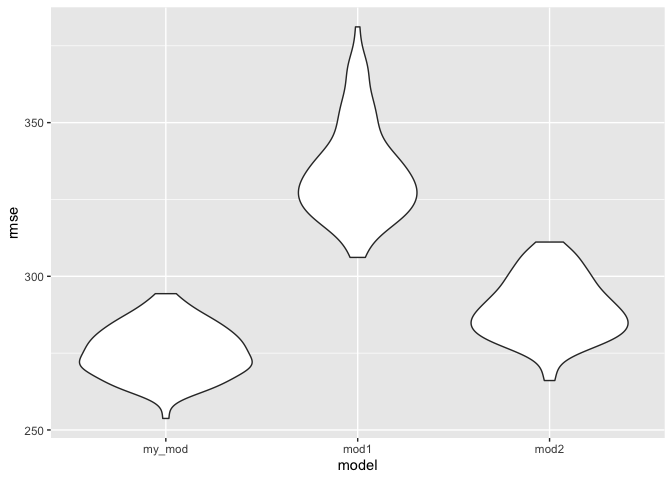
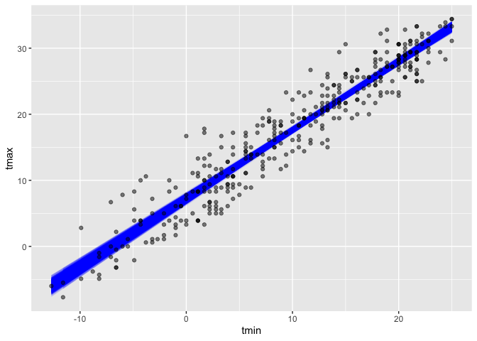

Homework 6
================
Ifrah Fayyaz
12/3/2021

#### Loading required libraries:

``` r
library(tidyverse)
library(rvest)
library(modelr)
library(mgcv)
library(broom)
```

## Problem 1

``` r
prob1 = 
  read_csv("./data/birthweight.csv") %>%
  mutate(babysex = as.factor(babysex)) %>%
  mutate(frace = as.factor(frace)) %>%
  mutate(malform = as.factor(malform)) %>%
  mutate(mrace = as.factor(mrace)) %>%
  select(-pnumlbw, -pnumsga) #Getting rid of these two variables 
                             #as they have all values = 0

sum(is.na(prob1))
```

    ## [1] 0

As the total number of missing values is `0`, we know that there are no
missing values in the dataset.

#### Proposed Regression Analysis:

For the regression analysis, I will first check which variables show a
crude associated with `birthweight` and then add them into a
multivariable model to assess significant predictors of `birthweight`.

**Crude Analysis:** <br> We will run simple regression models, checking
the associations between our outcome of interest `bwt` and all its
potential predictors.

``` r
# For continuous variables, we can use the following code to check significant predictors:

sig_check1 = prob1 %>%
  select(-bwt, -mrace, -frace, -babysex) %>%  # exclude outcome and factor variables
  map(~lm(prob1$bwt ~ .x, data = prob1)) %>% 
  map(summary) %>% 
  map(c("coefficients")) %>% 
  map_dbl(8) %>%
  knitr::kable(digits = 2)
sig_check1
```

|          |    x |
|:---------|-----:|
| bhead    | 0.00 |
| blength  | 0.00 |
| delwt    | 0.00 |
| fincome  | 0.00 |
| gaweeks  | 0.00 |
| malform  | 0.93 |
| menarche | 0.11 |
| mheight  | 0.00 |
| momage   | 0.00 |
| parity   | 0.58 |
| ppbmi    | 0.00 |
| ppwt     | 0.00 |
| smoken   | 0.00 |
| wtgain   | 0.00 |

``` r
sig_check2 = prob1 %>%
  mutate(babysex = fct_infreq(babysex)) %>%
  lm(bwt ~ babysex, data = .) %>%
  broom::tidy() %>%
  select(term, p.value) %>%
  knitr::kable(digits = 2)
sig_check2
```

| term        | p.value |
|:------------|--------:|
| (Intercept) |       0 |
| babysex2    |       0 |

``` r
sig_check3 = prob1 %>%
  mutate(mrace = fct_infreq(mrace)) %>%
  lm(bwt ~ mrace, data = .) %>%
  broom::tidy() %>%
  select(term, p.value) %>%
  knitr::kable(digits = 2)
sig_check3
```

| term        | p.value |
|:------------|--------:|
| (Intercept) |    0.00 |
| mrace2      |    0.00 |
| mrace4      |    0.00 |
| mrace3      |    0.09 |

``` r
sig_check4 = prob1 %>%
  mutate(frace = fct_infreq(frace)) %>%
  lm(bwt ~ frace, data = .) %>%
  broom::tidy() %>%
  select(term, p.value) %>%
  knitr::kable(digits = 2)
sig_check4
```

| term        | p.value |
|:------------|--------:|
| (Intercept) |    0.00 |
| frace2      |    0.00 |
| frace4      |    0.00 |
| frace3      |    0.15 |
| frace8      |    0.50 |

*Description:* <br> From the analysis above, we see that all variables
except `malform`, `menarche` and `parity` show significant crude
associations with our outcome of interest `bwt`. We will be excluding
these variables from the working dataset and run a multivariable
regression model.

**Multivariable Analysis:**

``` r
prob1_reg = prob1 %>%
  select(-malform, -menarche, -parity, -wtgain) # we are getting rid of "wtgain" because we are getting a 
                                                # coefficient of NA for it - meaning it is linearly  
                                                # related with other variables in the model

reg_model = lm(bwt ~ ., data = prob1_reg) 

reg_model %>%
  broom::tidy() %>%
  select(term, estimate, p.value) %>%
  mutate(term = str_replace(term, "babysex2", "Female")) %>%
  mutate(term = str_replace(term, "frace2", "Father: Black")) %>%
  mutate(term = str_replace(term, "frace3", "Father: Asian")) %>%
  mutate(term = str_replace(term, "frace4", "Father: Puerto Rican")) %>%
  mutate(term = str_replace(term, "frace8", "Father: Other")) %>%
  mutate(term = str_replace(term, "mrace2", "Mother: Black")) %>%
  mutate(term = str_replace(term, "mrace3", "Mother: Asian")) %>%
  mutate(term = str_replace(term, "mrace4", "Mother: Puerto Rican")) %>%
  knitr::kable(digits = 2) 
```

| term                 | estimate | p.value |
|:---------------------|---------:|--------:|
| (Intercept)          | -6281.32 |    0.00 |
| Female               |    29.31 |    0.00 |
| bhead                |   130.86 |    0.00 |
| blength              |    74.94 |    0.00 |
| delwt                |     4.15 |    0.00 |
| fincome              |     0.29 |    0.11 |
| Father: Black        |    12.92 |    0.78 |
| Father: Asian        |    19.48 |    0.78 |
| Father: Puerto Rican |   -49.16 |    0.27 |
| Father: Other        |     3.27 |    0.96 |
| gaweeks              |    11.26 |    0.00 |
| mheight              |     9.43 |    0.36 |
| momage               |     0.69 |    0.56 |
| Mother: Black        |  -150.59 |    0.00 |
| Mother: Asian        |   -93.56 |    0.19 |
| Mother: Puerto Rican |   -55.87 |    0.22 |
| ppbmi                |     4.30 |    0.77 |
| ppwt                 |    -3.48 |    0.18 |
| smoken               |    -4.87 |    0.00 |

*Description:* <br> From the multivariable analysis above, we see that
the following variables are significant predictors of birthweight:

-   `babysex`: Baby’s sex (Female babies significantly have higher
    birthweight as compared to male babies) <br>
-   `bhead`: baby’s head circumference at birth (greater head
    circumference associated with higher birthweight) <br>
-   `blength`: baby’s length at birth (greater length associated with
    higher birthweight) <br>
-   `delwt`: mother’s weight at delivery (higher weight of the mother
    associated with higher birthweight) <br>
-   `gaweeks`: gestational age in weeks (higher gestational age
    associated with higher birthweight) <br>
-   `mrace`: mother’s race (Black mothers are significantly associated
    with having lower birthweight babies as compared to white) <br>
-   `smoken`: average number of cigarettes smoked per day during
    pregnancy (greater number of cigarettes smoked associated with lower
    birthweight)

#### Model 1:

``` r
fit1 = lm(bwt ~ blength + gaweeks, data = prob1)

fit1 %>%
  broom::tidy() %>%
  select(term, estimate, p.value) %>%
  mutate(term = str_replace(term, "babysex2", "Female")) %>%
  knitr::kable(digits = 2) 
```

| term        | estimate | p.value |
|:------------|---------:|--------:|
| (Intercept) | -4347.67 |       0 |
| blength     |   128.56 |       0 |
| gaweeks     |    27.05 |       0 |

*Description:* <br> From the first model, we can see that both variables
`blength` (baby’s length at birth) and `gaweeks` (gestational age in
weeks) are significant predictors of our outcome of interest `bwt`.

#### Model 2:

``` r
prob1 = prob1 %>%
  mutate(babysex = fct_infreq(babysex))

fit2 = lm(bwt ~ bhead * blength * babysex, data = prob1)

fit2 %>%
  broom::tidy() %>%
  select(term, estimate, p.value) %>%
  mutate(term = str_replace(term, "bhead", "Head Circumference (cm)")) %>%
  mutate(term = str_replace(term, "blength", "Baby's Length (cm)")) %>%
  mutate(term = str_replace(term, "babysex2", "Female")) %>%
  mutate(term = str_replace(term, ":", " x ")) %>%
  mutate(term = str_replace(term, ":", " x ")) %>%
  knitr::kable(digits = 2)
```

| term                                                  | estimate | p.value |
|:------------------------------------------------------|---------:|--------:|
| (Intercept)                                           | -7176.82 |    0.00 |
| Head Circumference (cm)                               |   181.80 |    0.00 |
| Baby’s Length (cm)                                    |   102.13 |    0.00 |
| Female                                                |  6374.87 |    0.00 |
| Head Circumference (cm) x Baby’s Length (cm)          |    -0.55 |    0.48 |
| Head Circumference (cm) x Female                      |  -198.39 |    0.00 |
| Baby’s Length (cm) x Female                           |  -123.77 |    0.00 |
| Head Circumference (cm) x Baby’s Length (cm) x Female |     3.88 |    0.00 |

*Description:* <br> From the first model, we can see that both variables
`bhead` (baby’s head circumference), `babysex` (gender), `blength`
(baby’s length at birth) and their interactions are significant
predictors of our outcome of interest `bwt`.

**Cross-Validation Between Models:**

``` r
cv_fit1 = 
  crossv_mc(prob1, 100)

cv_fit1 = 
  cv_fit1 %>% 
  mutate(
    my_mod  = map(train, ~lm(bwt ~ babysex + bhead + blength + delwt + gaweeks + mrace + smoken, data = .x)),
    mod1  = map(train, ~lm(bwt ~ blength + gaweeks, data = .x)),
    mod2  = map(train, ~lm(bwt ~ bhead * blength * babysex, data = .x))) %>% 
  mutate(
    rmse_my_mod = map2_dbl(my_mod, test, ~rmse(model = .x, data = .y)),
    rmse_mod1 = map2_dbl(mod1, test, ~rmse(model = .x, data = .y)),
    rmse_mod2 = map2_dbl(mod2, test, ~rmse(model = .x, data = .y)))

cv_fit1 %>% 
  select(starts_with("rmse")) %>% 
  pivot_longer(
    everything(),
    names_to = "model", 
    values_to = "rmse",
    names_prefix = "rmse_") %>% 
  mutate(model = fct_inorder(model)) %>% 
  ggplot(aes(x = model, y = rmse)) + geom_violin()
```

<!-- -->

*Description:* <br> From the above violin plot showing the distribution
of RMSE values for each candidate model, we can see that the model I
proposed shows the least variance and prediction error, making it the
better competing model among the three.

## Problem 2

``` r
weather_df = 
  rnoaa::meteo_pull_monitors(
    c("USW00094728"),
    var = c("PRCP", "TMIN", "TMAX"), 
    date_min = "2017-01-01",
    date_max = "2017-12-31") %>%
  mutate(
    name = recode(id, USW00094728 = "CentralPark_NY"),
    tmin = tmin / 10,
    tmax = tmax / 10) %>%
  select(name, id, everything())
```

``` r
boot_sample = function(df) {
  sample_frac(df, replace = TRUE)
}

boot_straps = 
  data_frame(
    strap_number = 1:5000,
    strap_sample = rerun(5000, boot_sample(weather_df))
  )

boot_straps %>% 
  unnest(strap_sample) %>% 
  ggplot(aes(x = tmin, y = tmax)) + 
  geom_line(aes(group = strap_number), stat = "smooth", method = "lm", se = FALSE, alpha = .1, color = "blue") +
  geom_point(data = weather_df, alpha = .5)
```

<!-- -->

The above plot shows that the distribution of regression lines is
narrower near tmin = 13 and wider at the ends of the tmin distribution.

``` r
bootstrap_results = 
  boot_straps %>% 
  mutate(
    models = map(strap_sample, ~lm(tmax ~ tmin, data = .x)),
    results = map(models, broom::glance)) %>% 
  select(-strap_sample, -models) %>% 
  unnest(results) 


r2_ci = bootstrap_results %>% 
  summarize(
    ci_lower = quantile(r.squared, 0.025), 
    ci_upper = quantile(r.squared, 0.975))
```

The 95% confidence interval for r^2 is (0.894, 0.927)

``` r
bootstrap_results2 = 
  boot_straps %>% 
  mutate(
    models = map(strap_sample, ~lm(tmax ~ tmin, data = .x)),
    results = map(models, broom::tidy)) %>% 
  unnest(results) %>%
  select(strap_number, term, estimate) 

table2 = bootstrap_results2 %>%
  pivot_wider(
    names_from = "term",
    values_from = "estimate"
  ) %>%
  rename("beta0" = "(Intercept)") %>%
  mutate("log_betas" = log(beta0*tmin))


log_beta_ci = table2 %>% 
  summarize(
    ci_lower = quantile(log_betas, 0.025), 
    ci_upper = quantile(log_betas, 0.975))
```

The 95% confidence interval for log(beta0 \* beta1) is (1.965, 2.059)
